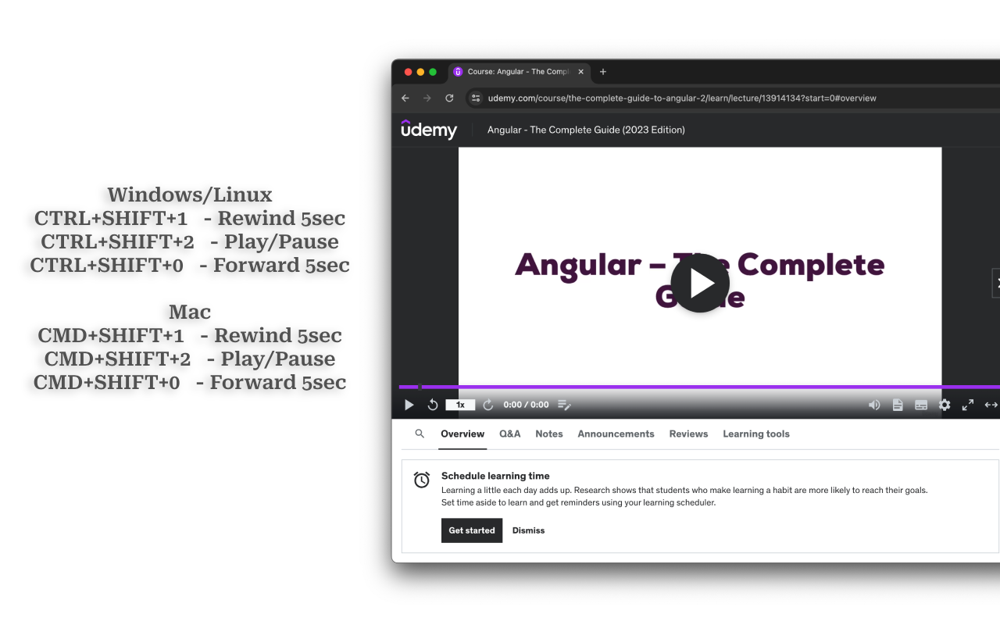

## Udemy Playback Control

The single purpose of this extension is to provide global keyboard shortcuts for controlling video playback on Udemy.

This allows users to control video playback without having to switch to the Udemy tab or monitor.

For example consider you have Udemy playing on external monitor and you are following coding tutorial in your editor on laptop screen, in this case you'll find yourself constantly switching between external and laptop screen to pause/rewind video.

With this extension however you can enable global keyboard shortcut for playback control, which means you continue to code in your editor and use keyboard shorts to pay/pause/rewind/forward tutorial on udemy.com

### Keyboard shortcuts

#### Windows/Linux

- Ctrl+Shift+1 - Rewind 5 sec
- Ctrl+Shift+2 - Play/Pause
- Ctrl+Shift+0 - Forward 5 sec

### Mac

- Command+Shift+1 - Rewind 5 sec
- Command+Shift+2 - Play/Pause
- Command+Shift+0 - Forward 5 sec

This extension will not work on Chrome OS.
